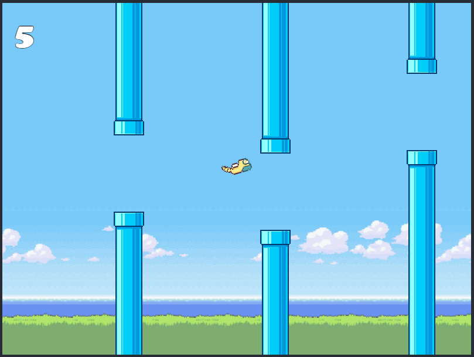
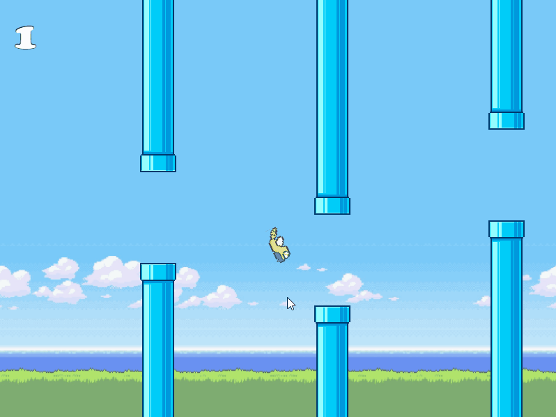

<div align="center">
  <br>
  <a href="https://dunsparce-phaser.vercel.app/"></a>
<h4 align="center">A FlappyBird remodel with the cute and adorable Pokemon, Dunsparce.</h4>
<p align="center">
  <a href="#about-the-game">About</a> •
  <a href="#gameplay">Gameplay</a> •
  <a href="#how-to-use">How To Use</a> •
  <a href="#the-developer">The Developer</a> •
  <a href="#credits">Credits</a> •
  <a href="#you-may-also-like">Others</a> •
  <a href="#license">License</a>
</p>
</div>

## **About the Game**

This is a game I built for Mintbean's August 2021 Hiring Hackathon Event. I primarily used PhaserJS, React, Bootstrap to build the entire landing page and game. This was my first attempt at creating a game and I am pretty proud of what I had accomplished in the short time I had to do this. This game is essentially a FlappyBird remake and remodel. The assets we're model and created based off the orignal game assets and was done by me. The audio assets were found online that I believe were from the original game as well.

## **Gameplay**

<!--  -->



## How To Use

To clone and run this application, you'll need [Git](https://git-scm.com) and [Node.js](https://nodejs.org/en/download/) (which comes with [npm](http://npmjs.com)) installed on your computer. From your command line:

```bash
# Clone this repository
$ git clone https://github.com/xjkbro/dunsparce-phaser

# Go into the repository
$ cd dunsparce-phaser

# Install dependencies
$ npm install

# Run the app
$ npm start
```

Note: If you're using Linux Bash for Windows, [see this guide](https://www.howtogeek.com/261575/how-to-run-graphical-linux-desktop-applications-from-windows-10s-bash-shell/) or use `node` from the command prompt.

## **The Developer**

Flappy Dunsparce was create by Jason-Kyle De Lara
If your enjoyed the application feel free to visit my website and look at my other projects.

[GitHub](https://github.com/xjkbro)
[LinkedIn](https://www.linkedin.com/in/jkdelara/)
[Website](https://www.jkdelara.com/)

## Credits

This project uses the following packages:

-   [React](https://reactjs.org/)
-   [Phaser3](https://www.phaser.io/phaser3)
-   [IonPhaser](https://www.npmjs.com/package/@ion-phaser/react)
-   [Bootstrap](https://getbootstrap.com/)
-   [ReactStrap](https://reactstrap.github.io/) (For utility components)
-   [MaterialUI](https://material-ui.com/) (For Icons)

## You may also like...

-   [DevFlow](https://github.com/xjkbro/devflow) - Web Development blog
-   [CanGrid](https://github.com/xjkbro/galleryio-next) - Social Media Platform

## License

MIT
